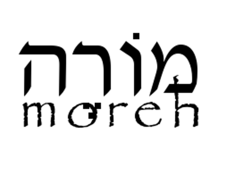

# Moreh
Moreh is a fully responsive theme for Wordpress, based on my foundational theme, Qohelet. Like Qohelet, it has been built on the shoulders of giants, utilizing a number of other technologies, such as: 1. The Quark starter theme by Anthony Horton. 2. Quark is in turn built upon Underscores by Automattix. 3. Quark utilizes Normalize, Modernizr and Options Framework. 4. Many other smaller amounts of other technologies have been incorporated, so that I did not re-invent the wheel. The theme is designed to work with LMS (Learning Management System) sites, and integrates well with Learnpress.

*Moreh* (**מוֹרֶה**) is the Hebrew word for teacher.

Because Moreh is a theme designed to work with LearnPress, there are a number of plugins which are either required or recommended for installation. These are:

* LearnPress
* Embed Any Document
* GitHub Updater
* GitHub Link
* OCWS Admin Bar
* OCWS Admin Bar Greeting
* Login Logo
* Video Background

## Version 0.3
* A few minor features tidied up
* The coding for required and recommended plugins was added

## Version 0.2
The latest version of Font Awesome was added (4.7)

## Version 0.1.1
The initial beta version.

